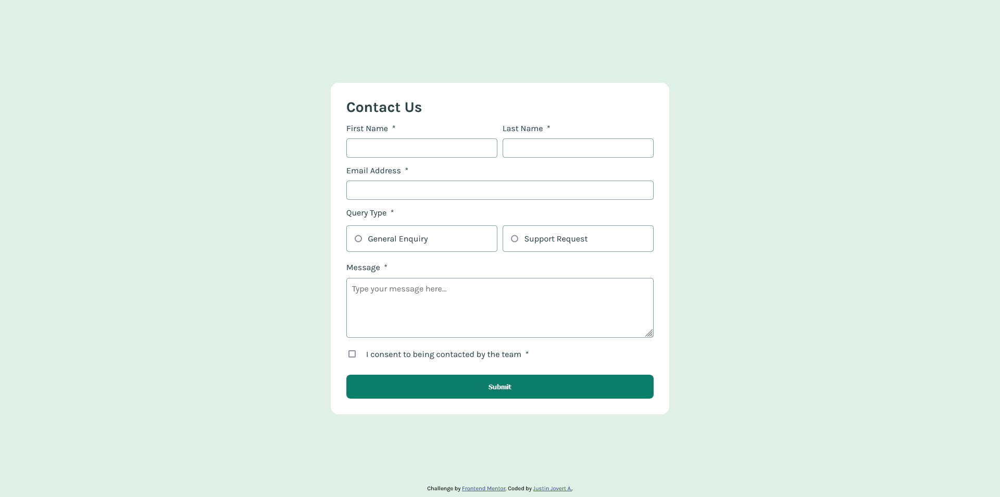

# Frontend Mentor - Contact form solution

This is a solution to the [Contact form challenge on Frontend Mentor](https://www.frontendmentor.io/challenges/contact-form--G-hYlqKJj). Frontend Mentor challenges help you improve your coding skills by building realistic projects. 

## Table of contents

- [Overview](#overview)
  - [The challenge](#the-challenge)
  - [Screenshot](#screenshot)
  - [Links](#links)
- [My process](#my-process)
  - [Built with](#built-with)
  - [Continued development](#continued-development)
  - [Useful resources](#useful-resources)
- [Author](#author)
- [Acknowledgments](#acknowledgments)

## Overview

A simple contact form using Flexbox and JavaScript.

### The challenge

Users should be able to:

- Complete the form and see a success toast message upon successful submission
- Receive form validation messages if:
  - A required field has been missed
  - The email address is not formatted correctly
- Complete the form only using their keyboard
- Have inputs, error messages, and the success message announced on their screen reader
- View the optimal layout for the interface depending on their device's screen size
- See hover and focus states for all interactive elements on the page

### Screenshot

### Links

- Live Site URL: [Github](https://justinjovert.github.io/Contact-Form)

## My process
  Built a container to hold the form and add some padding. 

  I used flex and flexwrap, with a min-width of 250px, so that if both grow and shrinks together. Once it reaches its minimum width, it wraps and then grows to fill the remaining space. With this I do not need to use media queries, as it is responsive to all screen sizes. 

### Built with

- Semantic HTML5 markup
- CSS custom properties
- Flexbox
- JavaScript

### Continued development

Continue to do challenges to solidify skills.

### Useful resources

- [Asaeneh's 30 Day of JavaScript](https://github.com/Asabeneh/30-Days-Of-JavaScript)

## Author

- [Github](https://github.com/Justinjovert/)
- Frontend Mentor - [Justinjovert](https://www.frontendmentor.io/profile/Justinjovert)

## Acknowledgments

Frontend Mentor and Asabeneh Yetayeh.